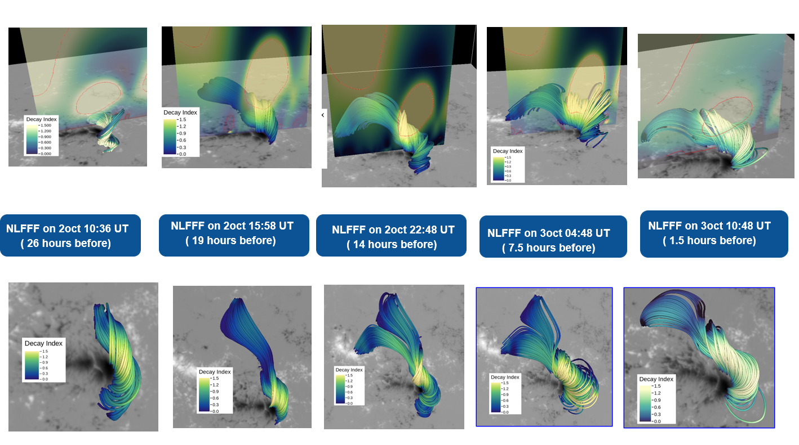

<!--Section 1: Introduce your self-->
## ABOUT ME

Hello! I'm Maitri Patel, a research analyst at Center for Solar-Terrestrial Research. 
I specialize in solar physics, with research spanning magnetohydrodynamic (MHD) simulations, solar flare analysis, and magnetic field modeling.
My work focuses on understanding how complex magnetic structures in the solar atmosphere evolve and trigger energetic events such as solar flares and coronal mass ejections (CMEs). I aim to contribute to improved space-weather forecasting through computational modeling and analysis of observational data.

<!--Mention your top/relevant skills here - core and soft skills-->
## WHAT I DO
3D MHD Simulations of eruptive solar flares using data-driven models and numerical solvers.

Magnetic Field Extrapolation (NLFFF) to reconstruct coronal magnetic structures from HMI vector magnetograms.

Computational Tools: Python, FORTRAN, VAPOR.

<!--Section 2: List 3-4 key projects-->

*A glimpse of my recent project I've been working on.*

**1. 3D MHD Simulation of an X9 Solar Flare ( Oct 31, 2024)**

  <strong>Evolution of a Pre-Eruptive Flux Rope (NLFFF Reconstruction)</strong> 
  This figure shows the time-evolution of the magnetic flux rope in the active region during the 26 hours leading up to 
  the X2.0 flare on 31 October 2024. Using NLFFF extrapolations, I reconstructed the 3D magnetic field and visualized changes 
  in twist, height, and decay index to identify conditions leading to instability and eruption.

<video width="100%" controls>
  <source src="movie-nlfff.mp4" type="video/mp4">
  Your browser does not support the video tag.
</video>

  <strong>From Potential Field to NLFFF: Formation of a Pre-Eruptive Flux Rope</strong> 
  This movie shows the transformation of the coronal magnetic field from a simple potential-field (current-free state) approximation to a full nonlinear force-free field (NLFFF) model reconstruction. As the model evolves, magnetic shear and twist intensify, revealing the emergence of a flux rope that stores the free magnetic energy responsible for driving the X9.0 flare on 31 October 2024. The NLFFF reconstruction captures increasing magnetic twist, sheared arcades, and the gradual formation of a pre-eruptive flux rope. This transition highlights how non-potential magnetic energy builds up before driving major solar eruptions.

<video width="100%" controls>
  <source src="movie-mhd.mp4" type="video/mp4">
  Your browser does not support the video tag.
</video>

  <strong>Data-driven MHD Simulation of the Solar Eruption (Initialized from NLFFF)</strong> 
  This animation presents a magnetohydrodynamic (MHD) simulation that models the eruption of the flux rope observed before the X9.0 flare on 31 October 2024. The simulation uses the NLFFF magnetic field as the initial condition, allowing the system to evolve freely under the full MHD equations (numerical model).

Key features shown in the movie:
Rising Flux Rope: The pre-eruptive magnetic structure loses equilibrium and rises rapidly.
Torus Instability: The rope undergoes twisting and expansion as instabilities develop.
Magnetic Reconnection: Field lines reconnect beneath the rope, forming flare loops.
Eruptive Dynamics: The system ejects upward in a CME-like eruption, releasing stored magnetic energy.

This model demonstrates how the transition from a stressed NLFFF structure to a dynamic MHD eruption explains the onset and development of major solar flares.

  <a href="project-details.html" target="_blank" 
     style="font-size:15px; color:#004aad; font-weight:600; text-decoration:none;">
     ➤ Read more about this project
  </a>

## CONTACT DETAILS

<table>
  <tbody>
    <tr>
      <td>📧</td>
      <td><a href="mailto:mp2325@njit.edu">mp2325@njit.edu</a></td>
    </tr>
    <tr>
      <td>📍</td>
      <td>NJ, USA</td>
    </tr>
    <tr>
      <td>⬇️</td>
      <td><a href="https://github.com/Maitri-Patel-23">GitHub Profile</a></td>
    </tr>
  </tbody>
</table>
